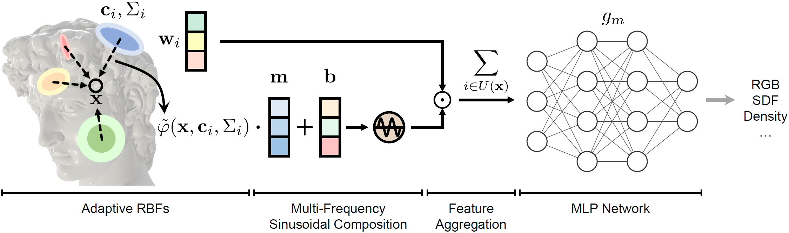
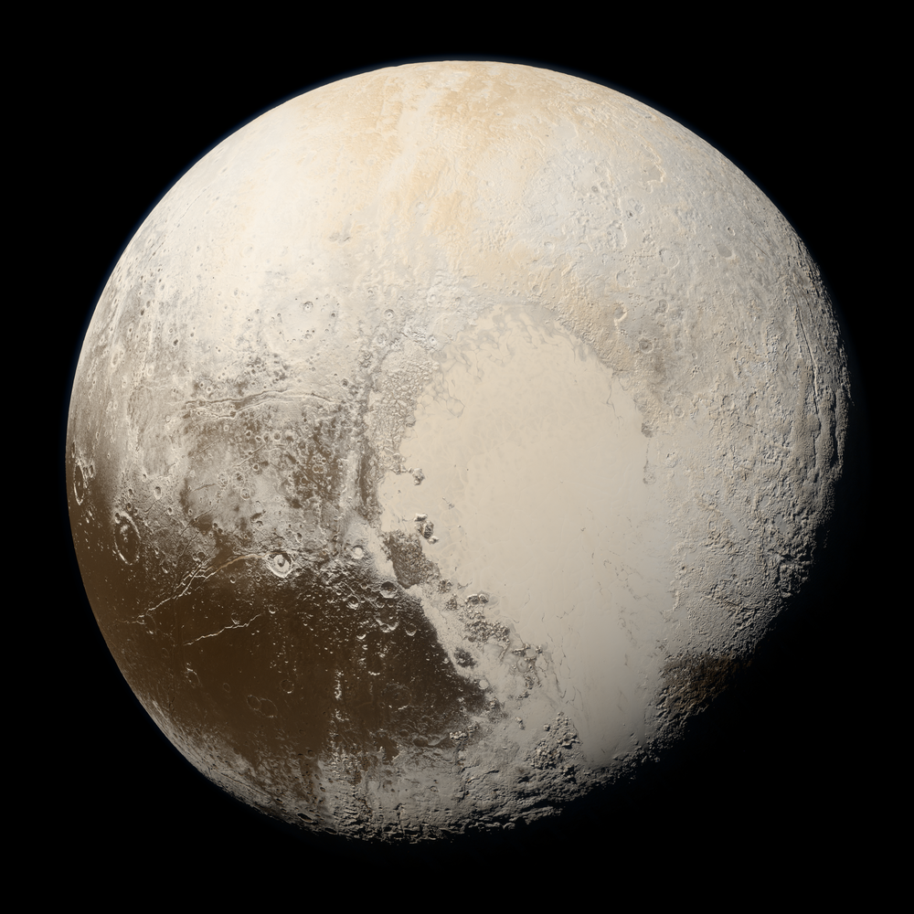
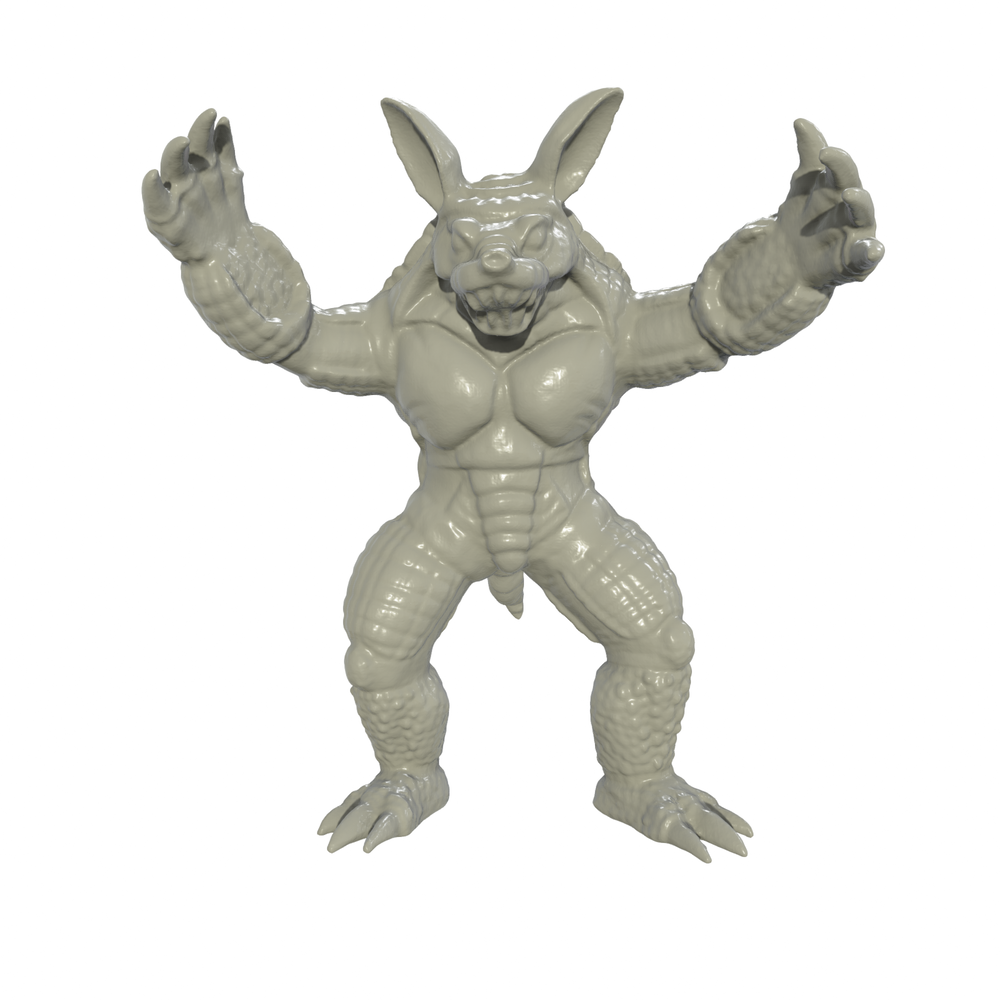
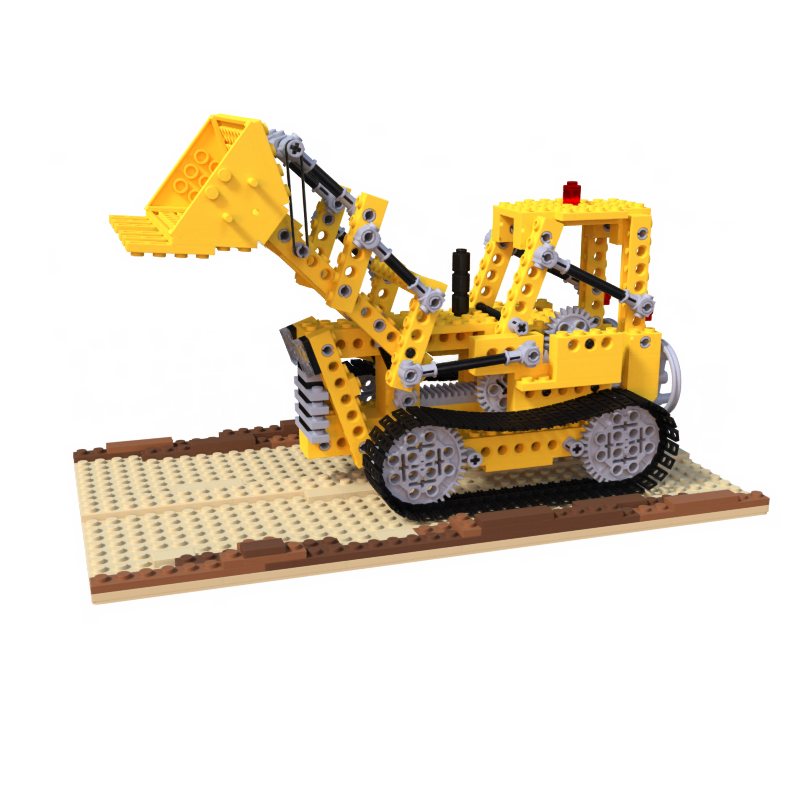
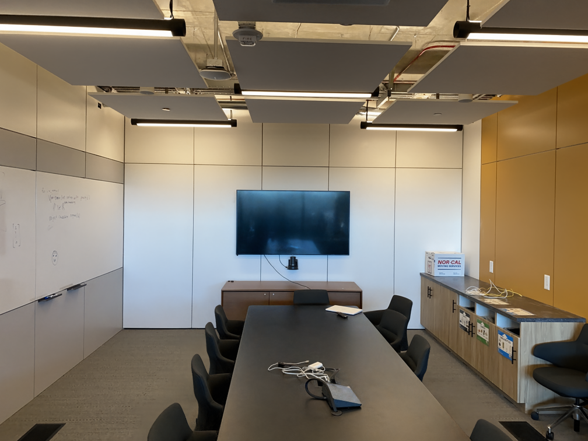

# NeuRBF: A Neural Fields Representation with Adaptive Radial Basis Functions

## ICCV 2023 (Oral)

[Zhang Chen](https://zhangchen8.github.io/)<sup>1</sup>,
[Zhong Li](https://sites.google.com/site/lizhong19900216)<sup>1</sup>,
[Liangchen Song](https://lsongx.github.io/)<sup>2</sup>,
[Lele Chen](https://lelechen63.github.io/)<sup>1</sup>,
[Jingyi Yu](http://www.yu-jingyi.com/cv/)<sup>3</sup>,
[Junsong Yuan](https://cse.buffalo.edu/~jsyuan/)<sup>2</sup>,
[Yi Xu](https://www.linkedin.com/in/yi-xu-42654823/)<sup>1</sup>  
<sup>1</sup>OPPO US Research Center, <sup>2</sup>University at Buffalo, <sup>3</sup>ShanghaiTech University

## [Project Page](https://oppo-us-research.github.io/NeuRBF-website/) | [Paper](https://arxiv.org/abs/2309.15426) | [Video](https://youtu.be/lqZ2FPktj3g/)

This repo is an official PyTorch implementation for the ICCV 2023 paper "NeuRBF: A Neural Fields Representation with Adaptive Radial Basis Functions". Our work presents a novel type of neural fields with high representation accuracy and model compactness. The repo contains the codes for image fitting, SDF fitting and neural radiance fields.



# Install

### Clone repository
```bash
git clone https://github.com/oppo-us-research/NeuRBF.git
cd NeuRBF
```

### Install conda environment
```bash
# Create conda environment
conda create -n neurbf python=3.9 -y
conda activate neurbf

# Install CuPy
pip install cupy-cuda11x
python -m cupyx.tools.install_library --cuda 11.x --library cutensor
python -m cupyx.tools.install_library --cuda 11.x --library cudnn
python -m cupyx.tools.install_library --cuda 11.x --library nccl

# Install PyTorch
pip install torch==2.0.1+cu117 torchvision==0.15.2+cu117 --index-url https://download.pytorch.org/whl/cu117

# For image/SDF fitting and NeRF task on Synthetic NeRF dataset
pip install einops matplotlib kornia imageio imageio-ffmpeg opencv-python pysdf PyMCubes trimesh plotly scipy GPUtil scikit-image scikit-learn pykdtree commentjson tqdm configargparse lpips tensorboard torch-ema ninja tensorboardX numpy pandas rich packaging scipy torchmetrics jax pillow plyfile omegaconf

# For NeRF task on LLFF dataset
pip install jax tqdm pillow opencv-python pandas lpips imageio torchmetrics scikit-image tensorboard matplotlib
pip install git+https://github.com/NVlabs/tiny-cuda-nn/#subdirectory=bindings/torch
```

### Build [torch-ngp](https://github.com/ashawkey/torch-ngp/tree/main) extension (for image/SDF fitting)
```bash
cd thirdparty/torch_ngp/gridencoder
pip install .
cd ../../../
```

### Tested environments
* Ubuntu 18.04 with PyTorch 1.13.0 & CUDA 11.6 on RTX A6000.
* Ubuntu 18.04 with PyTorch 2.0.1 & CUDA 11.7 on RTX A6000.
* Ubuntu 18.04 with PyTorch 2.0.1 & CUDA 11.7 on RTX 3090.
* Windows 11 with PyTorch 2.0.1 & CUDA 11.7 on RTX 3080 Ti 16G.

# Usage

## Image fitting

### Fit one image
Download an example [pluto image](https://solarsystem.nasa.gov/resources/933/true-colors-of-pluto/?category=planets/dwarf-planets_pluto). Put it in `data/img` and rename to `pluto.png`. Then run
```bash
python main.py --config configs/img.py --path ./data/img/pluto.png --alias pluto
```
The result and tensorboard log will be located in `log/img`. To adjust model size, you can specify the value of `--log2_hashmap_size_ref` argument.

NOTE: To reduce GPU memory usage, you can add `--ds_device cpu` to the above command. This will put some data on CPU instead of GPU, but will also make training slower.



### Fit all images in the DIV2K dataset
Download the [validation set](http://data.vision.ee.ethz.ch/cvl/DIV2K/DIV2K_valid_HR.zip) of the [DIV2K dataset](https://data.vision.ee.ethz.ch/cvl/DIV2K/) and put it in `data/img/div2k`. The path to each image should be `data/img/div2k/DIV2K_valid_HR/xxxx.png`. Then run
```bash
python main_img_div2k.py
```
The script will fit each image separately and the results will be stored in `log/img_div2k`.

## SDF fitting
Download an example [armadillo mesh](http://graphics.stanford.edu/pub/3Dscanrep/armadillo/Armadillo.ply.gz) of the [Stanford 3D Scanning Repository](https://graphics.stanford.edu/data/3Dscanrep/). Unzip it, put it in `data/sdf`, and rename to `armadillo.ply`.

Run the following preprocessing script, which normalizes the mesh and sample additional evaluation points.
```bash
python preproc_mesh.py --path ./data/sdf/armadillo.ply
```
Then run
```bash
python main.py --config configs/sdf.py --path ./data/sdf/armadillo_nrml.obj --alias armadillo
```
The result and tensorboard log will be located in `log/sdf`. To adjust model size, you can specify the value of `--log2_hashmap_size_ref` argument.

NOTE: To reduce GPU memory usage, you can similarly add `--ds_device cpu` to the above command.



## NeRF

### Dataset
* [Synthetic NeRF](https://drive.google.com/drive/folders/1JDdLGDruGNXWnM1eqY1FNL9PlStjaKWi)
* [LLFF](https://drive.google.com/drive/folders/14boI-o5hGO9srnWaaogTU5_ji7wkX2S7)

### Run on Synthetic NeRF Dataset
Download the dataset and unzip to `data`. For example, the path to the lego scene should be `data/nerf_synthetic/lego`. 

For training, use the following command
```bash
python main_nerf.py --config_init configs/nerf_tensorf/nerf_synthetic_init.py --config configs/nerf_tensorf/nerf_synthetic.py --data_name lego
```
It will first distill scene information to initialize RBF position and shape parameters, and then train the full model. The result and tensorboard log will be located in `log/nerf_synthetic`. Change `--data_name` to run on other scenes.

NOTE: To reduce GPU memory usage, you can add `--batch_size_init 2048` (tested working on RTX 3090 24G). The number `2048` can be further lowered if needed.



To render images using a trained model, run
```bash
python main_nerf.py --config configs/nerf_tensorf/nerf_synthetic.py --data_name lego --ckpt [path_to_checkpoint] --render_only 1 --[what_to_render] 1
```
where `[path_to_checkpoint]` is the path to the checkpoint file and `[what_to_render]` can be `render_test` or `render_train`. Note that the training command already conducts `render_test` at the end of training.

To extract mesh from a trained model, run
```bash
python main_nerf.py --config configs/nerf_tensorf/nerf_synthetic.py --data_name lego --ckpt [path_to_checkpoint] --export_mesh 1
```

### Run on LLFF Dataset
Download the dataset and unzip to `data`. For example, the path to the room scene should be `data/nerf_llff_data/room`. 

For training, use the following command
```bash
python main_nerf_kplanes.py --config_init configs/nerf_kplanes/llff_init.py --config configs/nerf_kplanes/llff.py --data_name room
```
It will first distill scene information to initialize RBF position and shape parameters, and then train the full model. The result and tensorboard log will be located in `log/llff`. Change `--data_name` to run on other scenes.

To render a spiral-path video using a trained model, run
```bash
python main_nerf_kplanes.py --config configs/nerf_kplanes/llff.py --log-dir [model_folder] --render-only
```
where `[model_folder]` is the path to the folder that contains the trained model.



## Acknowledgement
We sincerely thank the authors of the following repos, whose work has been referenced in our released codes: [torch-ngp](https://github.com/ashawkey/torch-ngp), [TensoRF](https://github.com/apchenstu/TensoRF), [nrff](https://github.com/imkanghan/nrff), [K-Planes](https://github.com/sarafridov/K-Planes), [MINER_pl](https://github.com/kwea123/MINER_pl), and [siren](https://github.com/vsitzmann/siren).

## Citation
If you find our work useful, please consider citing:
```BibTeX
@inproceedings{chen2023neurbf,
    author    = {Chen, Zhang and Li, Zhong and Song, Liangchen and Chen, Lele and Yu, Jingyi and Yuan, Junsong and Xu, Yi},
    title     = {NeuRBF: A Neural Fields Representation with Adaptive Radial Basis Functions},
    booktitle = {Proceedings of the IEEE/CVF International Conference on Computer Vision (ICCV)},
    month     = {October},
    year      = {2023},
    pages     = {4182-4194}
}
```
